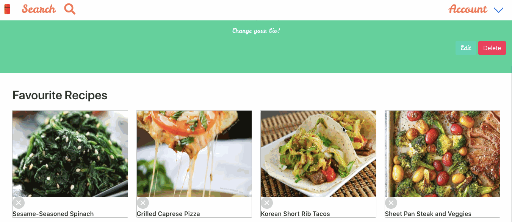
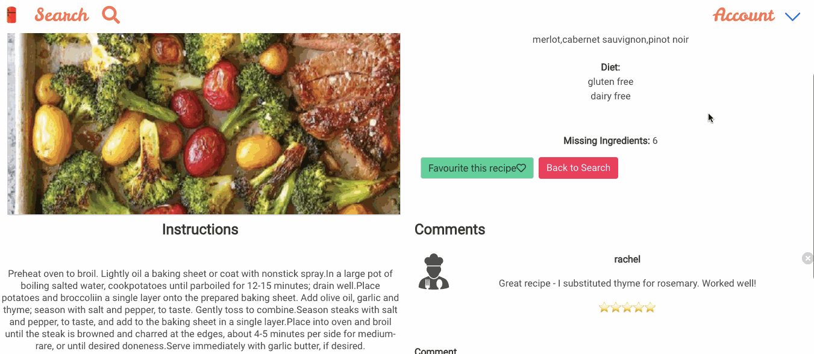
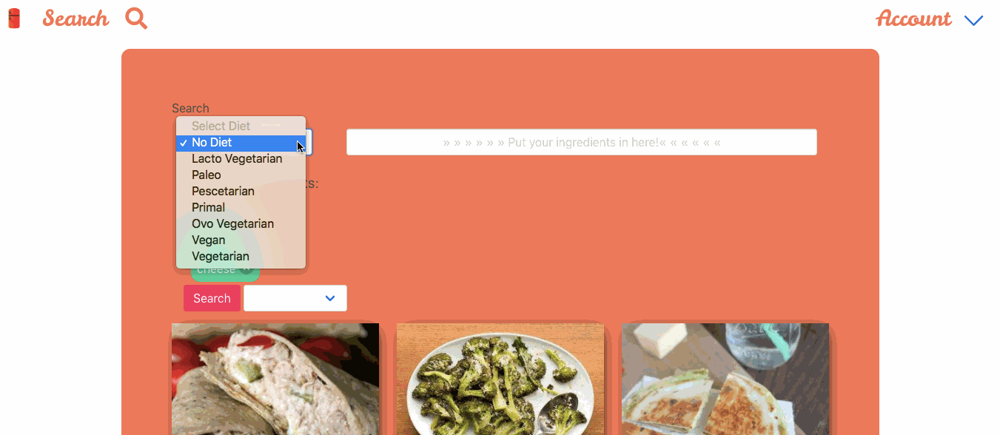

# GA WDI-34  Project #3: A MEAN stack Application
## 'What's In My Fridge?'

 - Linda Lê
 - Natasha Ramburrun
 - Rachel Dolan

 What's in your fridge application has been designed and developed by Linda Le, Rachel Dolan and Natasha Ramburrun.

---

 ### Project Brief

 * A **working API, built by the whole team**, hosted somewhere on the internet
 * A handmade Angular front-end **that consumes your own API**, hosted somewhere on the internet
 * A **link to your hosted working app** in the URL section of your Github repo
 * A **team git repository hosted on Github**, with a link to your hosted project, and frequent commits from _every_ team member dating back to the _very beginning_ of the project
 * **Use Mongo, Node & Express** to build a server-side API
 * **Your API must have at least 2 related  models**, one of which should be a user
 * Your API should include **all RESTFUL  actions** for at least one of those models
 * Include **authentication** to restrict   access to appropriate users
 * **Include at least one referenced or   embedded sub-document**, however don't go   crazy! You need to manage your time   effectively...
 * **Include automated tests** for at   least one resource
 * **Use Angular** to build a front-end   that consumes your API
 * **Use SCSS instead of CSS**
 * **Use Webpack & Yarn** to manage your dependencies and compile your source code

---

### Overview

The idea is that users can search on the app for recipes based on the ingredients they already have at home, for convenience and to cut down on wastage.

###### Landing page

---

### Technologies:

For this project we used the following technologies:

* HTML5
* CSS3 & SCSS
* Bulma
* JavaScript
* AngularJS
* Node.js
* Express
* Mongoose
* bcrypt
* JWT
* File Picker
* Satellizer
* Git
* GitHub
* Heroku
* Trello
* Draw.io
* Webpack
* Yarn

---

The project was planned using the project management tool trello, and we devised the user experience using wireframes on draw.io.  

### The Build

Our application was built around the spoonacular API which was central to our idea. Using this API allowed us to search by ingredients and list all the relevant recipes. The API also enables the user to filter by their dietary requirements as well as using autocomplete functionality to make the process of searching smoother and avoid incorrect data from being inputted.

 

 ###### Users can input multiple ingredients which are pushed into an array and can also be removed using splice.

 Our app uses a RESTful design pattern; users can visit their profile page, create and delete comments/ratings, favourite and unfavourite recipes, search for new recipes and view individual recipe pages for more information.

  

  ###### Users can 'star' their favourite recipes which then appear on their profile page and can be accessed every time they visit the site.

---

 ### Learnings

Initially we wanted to be able to organise recipes based on the number of missing or included ingredients, but too late into the project we realised that the type of request we were making didn't include this information. We were able to include it in a subsequent request made to the API based on an individual recipe.

  

  ###### Users can click a recipe to go to the individual recipe page and get instructions on preparing the dish, the ability to comment and read comments from other users, see the number of missing ingredients and recommended wine pairings.

We were able to add another filter feature which allows the user to input any dietary requirements, including pescatarian, gluten-free etc.

  

  ###### Users can filter recipes by dietary requirements

Throughout the process we also encountered some challenges using the API, including incorrect and inconsistent data. In future I'd take more time to research the API before placing it at the centre of an application, and read more reviews left by other users to know some of the challenges we might face.

It was also my first experience carrying out tests which was challenging but getting tests on the API to pass was actually one of my highlights.

---

 ### Extra Features

Moving forward I'd like to add

* Comment moderation, include Facebook OAuth (something we started but had to leave behind because of changes to privacy settings)
* A randomly generated recipe inspiration page, and allow users to organise recipes by ratings
* Implement a rating system - something we started but couldn't finish within the time we had
